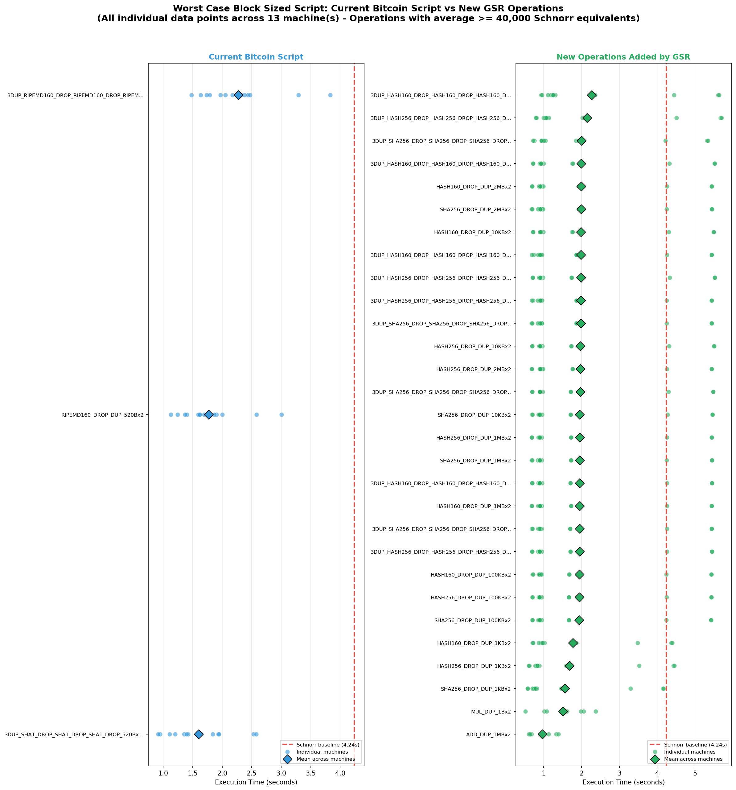
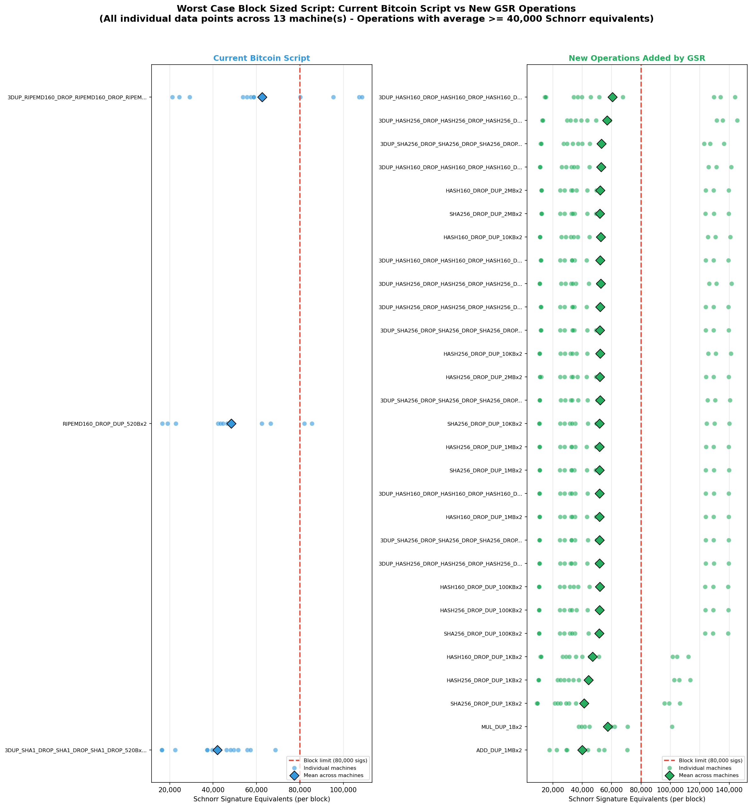
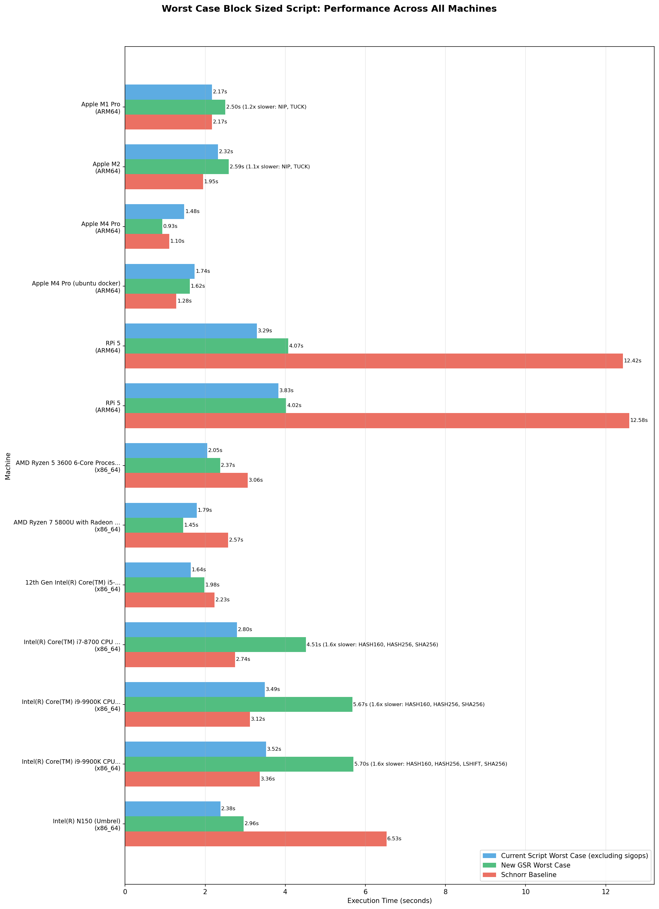
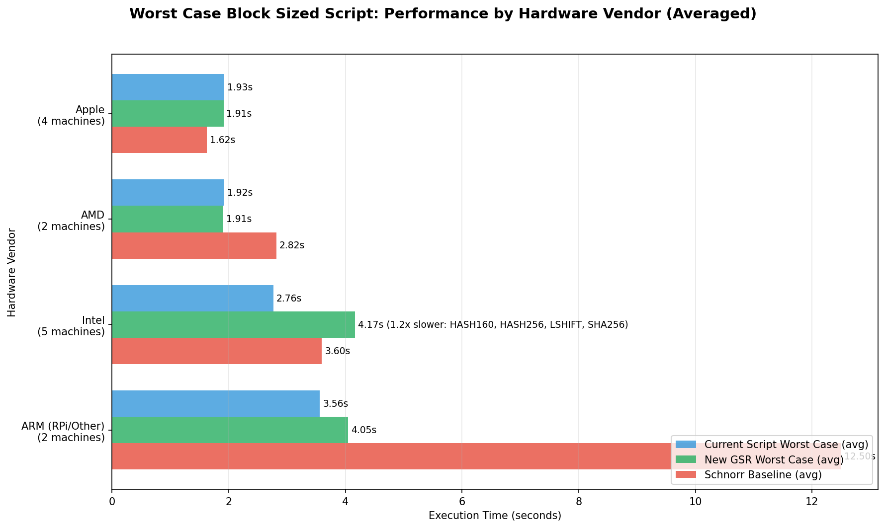
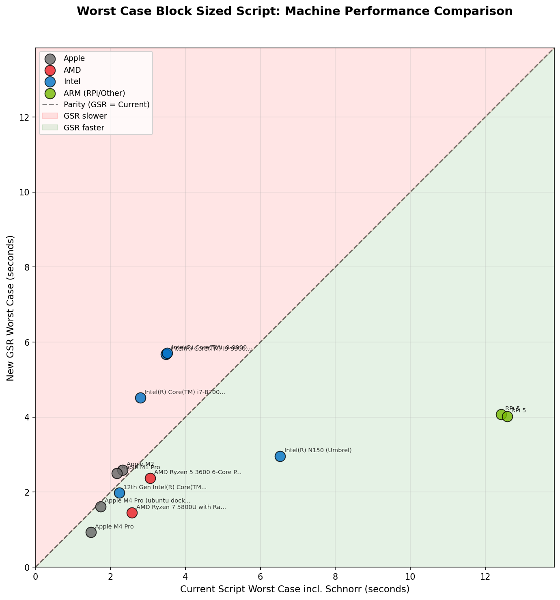

# varopsData
Collection of csv files produced by the bench_varops bitcoin core benchmark.

This data supports the analysis of the proposed [Varops Budget BIP](https://github.com/rustyrussell/bips/blob/guilt/varops/bip-unknown-varops-budget.mediawiki) and [Great Script Restoration BIP](https://github.com/rustyrussell/bips/blob/guilt/varops/bip-unknown-script-restoration.mediawiki).

## Benchmark Results

### Absolute Time (Seconds)

*Figure 1: Execution time in seconds for worst-case block-sized scripts. Left panel shows current Bitcoin Script operations; right panel shows proposed GSR operations including new stack limits. Each point represents a single machine, diamonds indicate the mean across all machines.*

### Schnorr-Normalized Units

*Figure 2: Performance expressed in Schnorr signature equivalents per block. This normalization allows comparison against the existing block validation budget of 80,000 signature operations.*

### Performance by Individual Machine

*Figure 3: Worst-case execution times across all tested machines, comparing current script operations (excluding sigops), new GSR operations, and the Schnorr baseline. Machines are grouped by architecture and vendor.*

### Performance by Vendor

*Figure 4: Averaged worst-case performance grouped by hardware vendor. This aggregation reveals vendor-specific performance characteristics across Apple, AMD, Intel, and ARM (Raspberry Pi) platforms.*

### Machine Performance Scatter

*Figure 5: Scatter plot comparing each machine's current script worst case (including Schnorr) against its GSR worst case. Points below the diagonal indicate machines where GSR operations are faster than current worst-case operations.*
